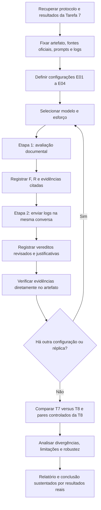

# Fluxograma — Tarefa 8

O fluxo preserva artefato, critérios, prompts e logs da Tarefa 7. Somente **versão** e **esforço de raciocínio** variam no plano principal.

```mermaid
flowchart TD
  A[Recuperar protocolo e resultados da Tarefa 7] --> B[Fixar artefato, fontes oficiais, prompts e logs]
  B --> C[Definir configurações E01 a E04]
  C --> D[Selecionar modelo e esforço]
  D --> E[Etapa 1: avaliação documental]
  E --> F[Registrar F, R e evidências citadas]
  F --> G[Etapa 2: enviar logs na mesma conversa]
  G --> H[Registrar vereditos revisados e justificativas]
  H --> I[Verificar evidências diretamente no artefato]
  I --> J{Há outra configuração ou réplica?}
  J -->|Sim| D
  J -->|Não| K[Comparar T7 versus T8 e pares controlados da T8]
  K --> L[Analisar divergências, limitações e robustez]
  L --> M[Relatório e conclusão sustentados por resultados reais]
```